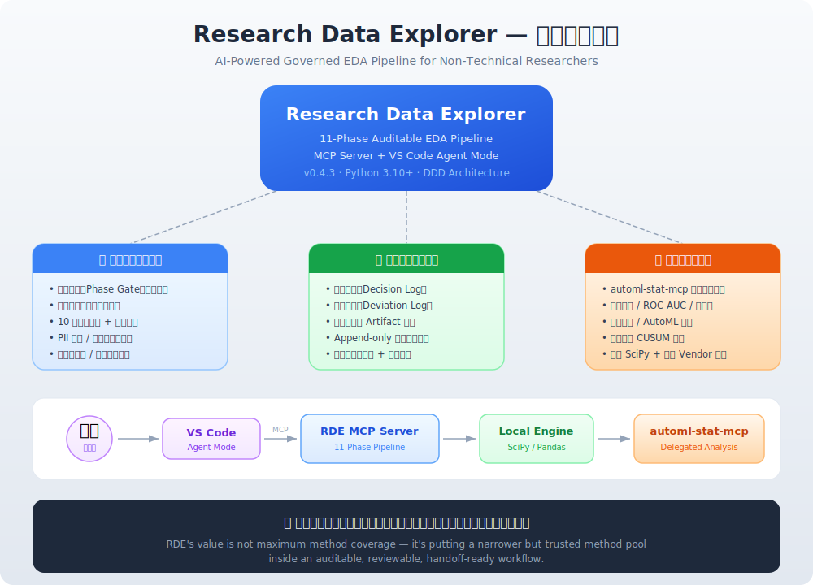
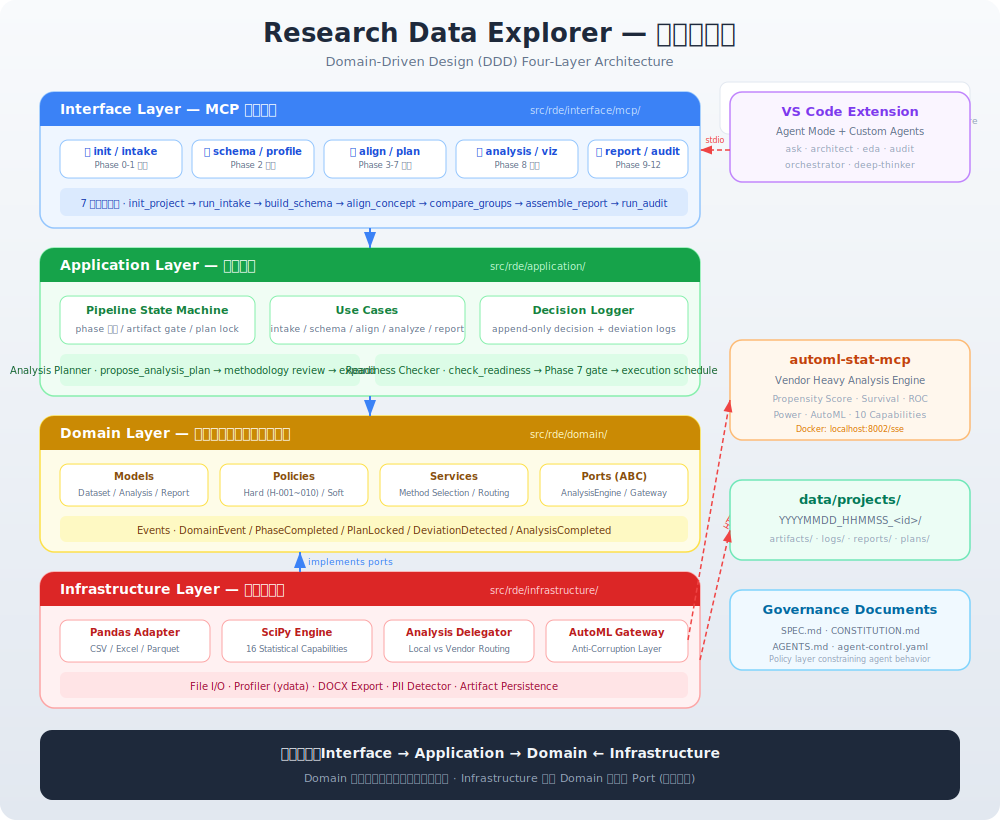
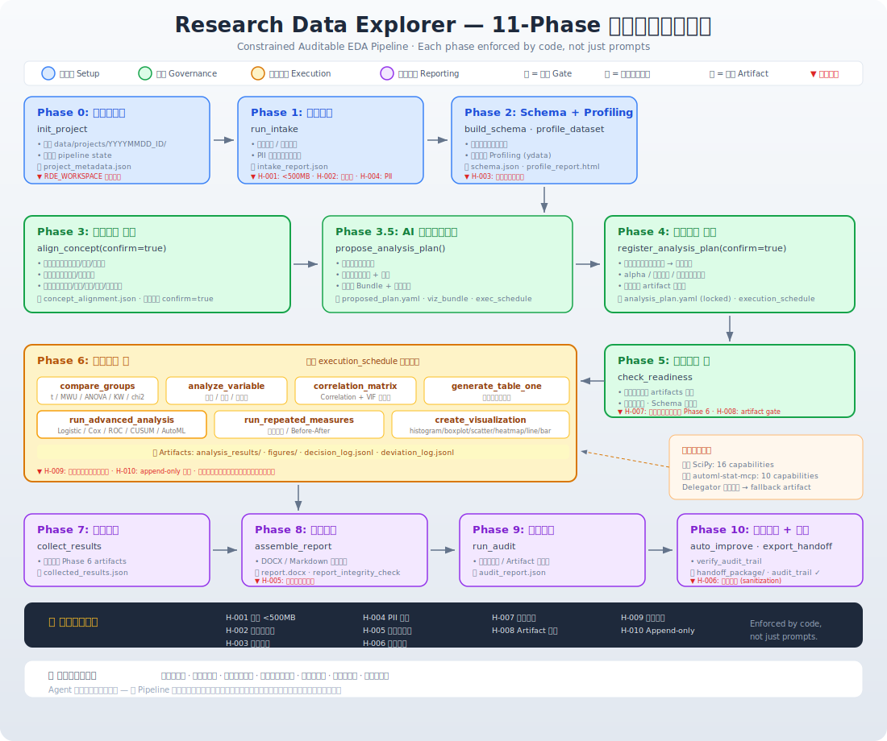

# Research Data Explorer

## 核心產品契約

RDE 的目標使用者不是資料科學家，而是有真實資料、但不知道該跑哪些分析、不知道怎樣組合方法、也不會寫分析程式的使用者。因此 MCP + harness 必須讓 agent 完成五件事：

1. 透過 intake、schema、profile、quality、PII 檢查了解資料
2. 從研究問題與變數角色規劃分析
3. 用 decision/deviation log 做可重現探索
4. 執行分析並嘗試用白話解釋，Docker 不可用時也能用 local-lite 跑調整模型、ROC/AUC、基本 power、Kaplan-Meier 與輕量 propensity scoring
5. 產出可 audit、可改善、可匯出、可 handoff 的完整報告

`report_readiness` 與 `run_audit` 會正式檢查這份核心契約；缺少資料理解、分析規劃、readiness、執行解釋、可重現紀錄、報告產出或 agent/no-code harness 時，會以 `core_goal:*` 缺口阻擋 production-ready。

Research Data Explorer，簡稱 RDE，是一個把資料探索流程做成可約束、可審計、可再現的 MCP 伺服器專案。

它的核心不是「幫你自動分析」，而是「限制代理一定要照經得起審視的方法學流程分析」。

更誠實地說：

- 如果是一般、可模板化的分析族群，RDE 會把它們納進受治理流程
- 如果是特殊、領域依賴、研究設計依賴很重的方法，通常仍需要手動分析、客製 vendor service，或另外寫專用程式
- 所以 RDE 不是「所有統計方法的萬用自動分析 MCP」
- 而如果你只要一般性的自動摘要或一鍵式 auto-analysis，生態系裡也已經有其他更偏通用型的 MCP / agent 工具

RDE 真正想解的不是「方法數量最大化」，而是「把有限但可信的方法族群放進可稽核、可審查、可交接的治理流程」。

這個 repo 目前已經把以下事情接起來：

- 13-phase auditable EDA pipeline
- hard constraints 與 soft constraints
- plan lock 與 artifact gate
- append-only decision log / deviation log
- local-lite no-Docker 進階分析 + 可選 automl-stat-mcp 委派
- 報告、審計、handoff package 匯出

英文版入口說明請見 [README.md](README.md).

## 視覺總覽

### 整體概念總覽



### 系統架構圖（DDD）



### 13-Phase 工作流程細部圖



## 這個 Repo 在約束什麼

這個專案不是只靠提示詞要求 Copilot 聽話，而是用程式與 pipeline 狀態實際限制它。

關鍵治理文件：

- [AGENTS.md](AGENTS.md)
- [.github/copilot-instructions.md](.github/copilot-instructions.md)
- [SPEC.md](SPEC.md)
- [CONSTITUTION.md](CONSTITUTION.md)
- [.github/agent-control.yaml](.github/agent-control.yaml)

這次也補上讓 VS Code agent mode 真正吃到 repo 規則的配套檔：

- [.vscode/settings.json](.vscode/settings.json)
- [.github/agents](.github/agents)
- [.github/prompts](.github/prompts)
- [.github/workflows/ci.yml](.github/workflows/ci.yml)
- [ARCHITECTURE.md](ARCHITECTURE.md)
- [CONTRIBUTING.md](CONTRIBUTING.md)
- [SECURITY.md](SECURITY.md)

關鍵實作位置：

- MCP server 入口: [src/rde/__main__.py](src/rde/__main__.py)
- MCP tool 註冊: [src/rde/interface/mcp/server.py](src/rde/interface/mcp/server.py)
- pipeline state machine: [src/rde/application/pipeline/__init__.py](src/rde/application/pipeline/__init__.py)
- append-only decision log: [src/rde/application/decision_logger.py](src/rde/application/decision_logger.py)
- 委派分析邏輯: [src/rde/infrastructure/adapters/analysis_delegator.py](src/rde/infrastructure/adapters/analysis_delegator.py)
- vendor gateway: [src/rde/infrastructure/adapters/automl_gateway.py](src/rde/infrastructure/adapters/automl_gateway.py)

## 13-Phase 約束流程

完整工作流如下：

1. Phase 0: `init_project`
2. Phase 1: `run_intake`
3. Phase 2: `build_schema`、`profile_dataset`
4. Phase 3: `align_concept(confirm=true)`
5. Phase 4: `propose_analysis_plan()`
6. Phase 5: `register_analysis_plan(confirm=true)` 方法完整性審查
7. Phase 6: `register_analysis_plan(confirm=true)` 鎖定分析計畫
8. Phase 7: `check_readiness`
9. Phase 8: 執行分析工具
10. Phase 9: `collect_results`
11. Phase 10: `assemble_report`
12. Phase 11: `run_audit`
13. Phase 12: `auto_improve`、`export_handoff`、`verify_audit_trail`

### 你真正會被哪些規則卡住

這些規則不是建議，是會影響能不能往下執行。

#### Hard Constraints

- H-001: 檔案大小必須小於 500MB
- H-002: 檔案格式必須在白名單內
- H-003: 樣本量不足時不能做統計分析
- H-004: 偵測到疑似 PII 預設拒絕載入
- H-005: 報告組裝前要過完整性檢查
- H-006: 輸出前要清除敏感路徑資訊
- H-007: Phase 8 執行前一定要有 Phase 6 鎖定的 plan
- H-008: 前一 phase artifact 不完整不能進下一 phase
- H-009: Phase 8 分析操作要寫 decision log
- H-010: decision log 與 deviation log 是 append-only

#### Soft Constraints

這些不一定阻擋你，但 agent 會提醒：

- 常態性與有母數/無母數選擇
- 多重比較校正
- 缺失模式檢查
- 高共線性警告
- 效果量是否完整
- 檢定力與敏感度分析建議

### 三層完成度 contract

repo 現在不把「有報告就算完成」當成終點，而是把完成度拆成三層，並在不同 phase 實際 enforce：

- `minimum_complete`：最低限度的 auditable EDA。
  Phase 4 的 methodology review 至少要過，而且在 candidate pool 足夠時，不應低於 4 個分析族群。
  它代表 agent 不能只交出一張 Table 1 加一個 p 值就算結案。
- `academic_ready`：預設應該瞄準的投稿等級分析規格。
  目前 planner 會把 target 拉到大約 6 個分析族群，通常至少涵蓋 cohort overview、group comparison、association structure、至少 1 個 adjusted model，以及足夠的 descriptive / analytical figures。
  也就是除了描述，還要交代結構、混雜、模型與視覺化證據。
- `production_ready`：不是只靠 Phase 4 多排幾個 analysis 就成立，而是 Phase 4 到 Phase 10 一起成立的完成條件。
  除了 plan tier 要到 `production_ready` 之外，還要同時滿足 publication bundle、traceability、audit、report export artifacts。
  `collect_results` 現在會寫出 `report_readiness` artifact；`assemble_report` 與 `export_report` 預設只接受 `production_ready`，除非明示 `allow_incomplete=true`；`run_audit` 也會正式評 `report_readiness`；`auto_improve` 產出的 `final_report.md` 會直接寫出為什麼已達或尚未達 production-ready。

## Copilot 在這裡怎麼被約束

如果代理是透過這個 repo 提供的 MCP tools 工作，它會同時受到四層限制：

1. 規範層
   - [AGENTS.md](AGENTS.md)、[.github/copilot-instructions.md](.github/copilot-instructions.md)、[CONSTITUTION.md](CONSTITUTION.md)
2. Pipeline 層
   - [src/rde/application/pipeline/__init__.py](src/rde/application/pipeline/__init__.py) 會檢查 phase prerequisite、plan lock、artifact gate
3. Tool 層
   - [src/rde/interface/mcp/tools](src/rde/interface/mcp/tools) 在每個 tool 入口驗證前置條件
4. Audit 層
   - [src/rde/application/decision_logger.py](src/rde/application/decision_logger.py) 會保留決策與偏離紀錄

也就是說，這不是「叫 Copilot 自律」，而是「讓它不符合流程時就過不了」。

## 怎樣完成受約束的 Phase

### 最推薦的操作順序

如果你要完整、穩健、可稽核的流程，請照這個順序用：

1. `init_project`
2. `run_intake`
3. `build_schema`
4. `profile_dataset`
5. `align_concept(confirm=true)`
6. `propose_analysis_plan()`
7. `register_analysis_plan(confirm=true)`
8. `check_readiness`
9. `compare_groups` / `correlation_matrix` / `run_advanced_analysis`
10. `collect_results`
11. `assemble_report`
12. `run_audit`
13. `auto_improve`
14. `export_handoff`
15. `verify_audit_trail`

### 每個階段的實際重點

#### Phase 0-2

目的是把資料安全地帶進來，並建立 schema。

- `run_intake` 會做格式、大小、PII 初篩
- `build_schema` 會建立欄位型別與基礎統計
- `profile_dataset` 會產生更完整的 profiling 檢視

#### Phase 3-4

這是最重要的約束點，因為它把「研究問題」翻成「可稽核的分析 contract」。

`align_concept(confirm=true)` 應該至少確認：

- 分析單位是病人、就診、檢體、操作次數，還是施作者
- 主要暴露 / 分組欄位是什麼
- 主要結局與次要結局分別是什麼
- 每個結局的資料型態：連續、二元、類別、時間到事件、重複測量
- 需要調整的共變數、分層因子、排除條件與時間軸欄位

`register_analysis_plan(confirm=true)` 不只是「寫一個清單」，而是把後面允許做的分析方法、變數與 fallback 規則鎖定下來。

如果你想讓 agent 更自主地驅動 EDA，現在可以在 Phase 4 跑 `propose_analysis_plan()`。它不再只是單純 greedy 排序，而是會先做 draft candidate selection，再做內部 methodology review / repair；當 review 判斷有值得保留的延伸 EDA 路線時，也可以超過初始 budget 做 soft expansion。最後它會把 schema、變數角色、研究問題壓成一份經過自我檢查的候選分析排序、visualization bundle，以及一份可供 Phase 8 直接參考的 execution schedule，再輸出成可直接送進 `register_analysis_plan()` 的 blueprint。它的目的不是繞過用戶確認，而是把「該先做哪些分析」這件事變成可審查、可縮減、可鎖定的 artifact。

另外，`register_analysis_plan(confirm=true)` 現在也會在鎖定前做方法學審查。如果 plan 明顯低於資料結構所需的最低覆蓋，例如只有兩三個分析就想結束，但資料明明有 group、相關結構與可做 multivariable model 的條件，Phase 5 會先自動補入 optional exploratory branches；只有補完之後仍然太薄時，才會擋下來，要求先回到 `propose_analysis_plan()` 補足，除非你明確用 `allow_methodology_override=true` 覆蓋。計畫一旦在 Phase 6 鎖定，也會同步保存 execution schedule artifact，讓 Phase 8 可以沿著 reviewed blueprint 的順序跑，而不是每一步都重新即興決定。

可直接放進 Phase 4 的常見分析選項如下：

| 分析目的 | 典型欄位結構 | 建議工具 / 方法 | Phase 4 至少要鎖定的內容 |
| --- | --- | --- | --- |
| 基線描述 / Table 1 | 一個分組欄位 + 多個基線變數 | `generate_table_one` | 分組欄位、納入變數、是否顯示 overall / group 欄 |
| 兩組或多組差異比較 | 一個 group + 一個或多個 outcome | `compare_groups`；依型態自動選 t-test / Mann-Whitney U / ANOVA / Kruskal-Wallis / chi-square / Fisher | group、outcome、主要比較對象、是否需要多重比較校正 |
| 單變數剖析 | 單一欄位 | `analyze_variable` | 欄位名稱、是描述性重點還是推論前檢視 |
| 相關性 / 共線性 | 多個連續或混合欄位 | `correlation_matrix` + VIF 提醒 | 變數集合、是否要篩掉高共線性變數 |
| 重複測量 / 前後比較 | subject id + time/repeated measure + outcome | `run_repeated_measures` | 個體 ID、時間欄位、主要 outcome、配對或 repeated 設定 |
| 調整後模型 / 預測模型 | outcome + exposure + covariates | `run_advanced_analysis` | outcome、主要自變數、調整變數、模型族群（logistic / linear / Cox / ROC / power 等） |
| 學習曲線 / 操作表現 | operator + trial order + success / error | `run_advanced_analysis(analysis_type="learning_curve_cusum")` | operator、trial、success 定義、target success rate |
| 敏感度 / 子群分析 | 主分析欄位 + subgroup / alternate coding | 主分析後再用 `compare_groups` 或 `run_advanced_analysis` | 子群定義、替代變數定義、哪些結果需要 sensitivity check |
| 視覺化輸出 | outcome + optional group / time | `create_visualization` | 圖型、欄位、是否做分組、檔名規則 |

分析發想通常不只是一層判斷。比較穩的順序是：先定義問題型態，再看資料結構，最後才挑方法與圖。

| 思考層級 | 先問什麼 | 常見出口 | 對應工具 |
| --- | --- | --- | --- |
| 問題定位 | 我要回答的是描述現況、比較差異、看關聯，還是做調整後推論 / 預測？ | 先把問題分成描述、比較、關聯、建模四類 | `build_schema`、`profile_dataset`、`align_concept` |
| 結構辨識 | 有沒有分組欄位？有沒有時間軸或 repeated measure？outcome 是連續、二元、類別，還是時間到事件？ | 無 comparator 多半先做單變數；有 group 才進比較；多變數但無主 outcome 才進相關；有 covariates / prediction 需求才進建模 | `align_concept`、`check_readiness` |
| 方法選擇 | 問題句型是「長什麼樣」、 「有沒有不同」、 「會不會一起變」、還是「控制混雜後還成不成立」？ | `analyze_variable`、`compare_groups`、`correlation_matrix`、`run_repeated_measures`、`run_advanced_analysis` | `register_analysis_plan` |
| 圖證規劃 | 哪種圖最能支撐這個問題？是分布、差異、關聯，還是時間趨勢？ | histogram / boxplot / violin / scatter / heatmap / line / paired / bar | `create_visualization` |
| 治理鎖定 | 哪些是 primary、哪些是 secondary？alpha、missing strategy、fallback 與必要表圖是什麼？ | 形成可稽核 contract；之後偏離要記錄 | `register_analysis_plan(confirm=true)`、`log_deviation` |

可以用下面這個快速判斷：

- 只有分布檢查：只有單一變數，沒有 comparator、時間軸或調整需求，目的只是理解偏態、缺失、極端值或資料品質。
- 變相比較：有明確 group / exposure，問題是「A 和 B 是否不同」或「多組是否有差異」。
- 相關性：沒有明確 treatment-outcome 主從關係，問題是「X 和 Y 會不會一起變動」或「會不會共線」。
- 進階建模：需要控制混雜、做預測、做時間到事件、做 repeated structure、ROC、power、propensity，或像 learning-curve CUSUM 這種序列型問題。

#### Phase 4 要不要先設計圖？

要，而且最好在 Phase 4 就一起鎖定。現在 `create_visualization` 支援的圖型是：`histogram`、`boxplot`、`scatter`、`bar`、`violin`、`heatmap`、`line`、`paired`。

實務上可以先規劃「圖證 bundle」，而不是只想一張圖：

- 單一連續變數：`histogram` + `boxplot`
- 組間差異：`boxplot` 或 `violin`；若 outcome 是類別比例可加 `bar`
- 多變數關聯：`scatter` + `heatmap`
- 時間或前後變化：`line` 或 `paired`
- 如果你想要「簡易 4 plot」，可以把它定義成一個小型 figure bundle，而不是期待單一指令一次產生四張圖

除了分析種類，Phase 4 最少還要鎖定：

- 主要終點與次要終點
- alpha 與多重比較策略
- 缺失值策略
- 非常態或樣本不平衡時的 fallback 準則
- 需要輸出的表格、圖與 sensitivity analyses

三個實際例子：

1. 只有分布檢查
問題：我只想知道 creatinine 的分布、有沒有偏態或極端值。
建議：先做 `analyze_variable`，再配 `histogram` / `boxplot`。
這時還不需要 `compare_groups` 或 `run_advanced_analysis`。

2. 兩組臨床比較
問題：敗血症與非敗血症的乳酸、住院死亡是否不同。
建議：`generate_table_one` + `compare_groups`。如果還要控制 age、SOFA 等混雜，再升級成 `run_advanced_analysis`。
圖表：乳酸用 `boxplot` / `violin`，死亡率用 `bar`。

3. 操作學習曲線
問題：插管成功率會不會隨 trial 改善，何時趨穩。
建議：這不是單純 group comparison，而是 Phase 4 就要登記 `run_advanced_analysis(analysis_type="learning_curve_cusum")`。
圖表：原始趨勢可以用 `line`，正式證據則看 CUSUM artifact。

如果你不做這些規劃步驟，後面 Phase 8 的完整受約束分析就不成立；如果中途改方法，也應該用 `log_deviation` 留下理由。

#### Phase 5

`check_readiness` 會檢查：

- 樣本量是否足夠
- 是否有 PII
- plan 是否真的鎖定
- 前面 artifact 是否完整
- 常態性、缺失、共線性提醒

#### Phase 8

這裡是正式探索執行層：

- `compare_groups`
- `analyze_variable`
- `correlation_matrix`
- `generate_table_one`
- `run_advanced_analysis`
- `create_visualization`

這些操作會寫入 decision log；如果偏離已鎖定計畫，應該用 `log_deviation` 記錄原因。

#### 如果一層思考不夠，agent 可以怎麼幫忙

可以，但要分清楚「發想」和「執行」：

- `ask` / `Explore`：適合把口語研究問題整理成候選分析方向
- `architect`：適合把候選方向壓成 Phase 3-4 可治理的分析 contract
- `orchestrator`：適合把任務拆成 profiling、方法、圖表、audit 幾塊並安排順序
- `eda`：適合在 Phase 3-4 經確認後，嚴格照治理流程執行
- `audit`：適合事後檢查 plan adherence 與 artifact 完整性

換 agent 或換背後模型，可以增加「發想的廣度」，但不能取代 Phase 3 的變數對齊、Phase 4 的計畫鎖定、Phase 5 的 readiness 檢查。比較穩的做法是：先讓 agent 幫你展開候選分析，再把真正要做的內容寫回已確認的 analysis plan。

#### 方法覆蓋與為什麼不會全跑

RDE 目前不是「把 library 裡所有統計方法都跑一遍」的系統，而是「從受控方法池裡挑對方法」的系統。

截至目前，可以這樣理解方法覆蓋：

- 使用者在 Phase 8 主要會碰到 6 個分析入口加 1 個視覺化入口：`compare_groups`、`analyze_variable`、`correlation_matrix`、`generate_table_one`、`run_advanced_analysis`、`run_repeated_measures`、`create_visualization`
- Phase 4 的 analysis plan 目前允許登記 16 種 analysis types
- 本地 Scipy engine 在 manifest 中宣告 16 類能力
- local Scipy/tableone/local-lite 層在 manifest 中宣告核心與 no-Docker 進階能力；automl-stat-mcp 只作為可選重型委派層

這些數字不能直接相加，因為它們分別是「使用者入口」、「計畫類型」、「本地引擎能力」與「委派能力」，中間有重疊、別名與抽象層差異。

更重要的是，agent 不會自動把所有方法都跑過一次，原因是：

- `compare_groups` 本來就會依資料型態、組數、常態性與 paired/repeated 結構選一個比較合理的檢定，而不是把 t-test、Mann-Whitney U、ANOVA、Kruskal-Wallis、chi-square、Fisher 全部跑一輪
- Phase 3 到 Phase 6 要先把研究問題翻成可治理 contract，Phase 8 才照計畫執行
- 如果把所有可能方法都試過一次，會放大多重比較、方法漂移、假陽性與 audit noise
- 所以這裡是「精挑細選」，但目前的精選規則只涵蓋 repo 已實作、已測試、已被 plan schema 接受的方法族群；沒有寫進 schema / delegator / heuristics 的，就不會被受治理流程自動採用

換句話說，agent 不是不會，而是故意不該在受治理模式裡「想到什麼就全部跑」。

#### 可以借用 `autoresearch` 什麼概念

可以借概念，但不建議直接搬 code。

`karpathy/autoresearch` 值得借的地方是：

- 用一份輕量的「研究程式 / program」來描述 agent 應該探索哪些候選方向
- 先產生候選方案，再做 keep / discard
- 把 agent 的發想 loop 當成可迭代資產，而不是每次重新 prompt

但 RDE 不適合直接照搬的地方也很明確：

- autoresearch 是固定 budget 下反覆試跑、追單一指標；RDE 是多目標決策，還要受方法適配、可解釋性、稽核鏈、PII 與 plan lock 約束
- RDE 不能用「全部跑一遍看誰最好」取代統計方法學
- 生醫 / EDA 場景不適合無上限自我修改或無邊界 trial loop

比較合理的做法，是把這個概念改寫成 RDE 的「pre-lock candidate analysis generator」：

- 放在 Phase 3 到 Phase 4 之間
- 讓 agent 先展開候選分析、候選圖表、候選 sensitivity checks
- 但真正要執行的內容，仍然要回寫進 `analysis_plan.yaml` 並經 `confirm=true` 鎖定

如果未來真的把這個概念納進 repo，README 應該明確說明：這是「受 `autoresearch` 啟發的分析發想層」，不是直接移植原 repo 的 autonomous experiment loop。

#### Phase 7-10

- `collect_results` 彙整結果、publishable items，並產生 `report_readiness`
- `assemble_report` 組裝完整 EDA 報告；若未達預設完整度目標，預設會擋下終版組裝
- `run_audit` 評估完整性、計畫遵循、效果量、可再現性，並把 `report_readiness` 納入正式審計項目
- `auto_improve` 針對 audit 結果補做可自動修補的項目，並在 `final_report.md` 明寫 production-ready / not production-ready 的原因
- `export_handoff` 匯出給下游 repo 使用

## 怎樣善用 MCP

### 1. 啟動 RDE MCP Server

先安裝本 repo：

```bash
python3 -m pip install -e .
```

啟動 MCP server：

```bash
python3 -m rde
```

### 2. 可選：啟動 automl-stat-mcp

如果你要用進階統計或 AutoML 委派，另外啟動 vendor 服務：

```bash
cd vendor/automl-stat-mcp
docker compose --profile ml up -d
```

VSIX 核心報告流程不需要 Docker；RDE 會先使用 local-lite 完成調整模型、ROC/AUC、基本 power、Kaplan-Meier 與輕量 propensity scoring。automl-stat-mcp 只在需要重型 vendor workflow 或 AutoML training 時啟動。

### 3. 建議的 VS Code MCP 設定

可以用這樣的設定：

```json
{
  "servers": {
    "research-data-explorer": {
      "type": "stdio",
      "command": "python3",
      "args": ["-m", "rde"]
    },
    "automl-stat-mcp": {
      "type": "sse",
      "url": "http://localhost:8002/sse"
    }
  }
}
```

### 4. 問 Copilot 的方式也要對

如果你想讓代理盡量維持在受治理流程中，建議這樣下指令：

```text
我有一個 CSV，請用完整 13-phase auditable workflow。
不要跳過 concept alignment 和 plan lock。
Phase 5 沒完成前不要做進階分析。
如果要偏離計畫，請記錄 deviation。
```

如果你是在 VS Code 直接用 agent mode，建議保持 [.vscode/settings.json](.vscode/settings.json)、[.github/agents](.github/agents)、[.github/prompts](.github/prompts) 與治理文件同步，否則 editor 端能看到的規則會落後於 repo 真實約束。

## 目前已驗證到什麼程度

這個 repo 不是只有單元測試，還做過 live vendor contract 與真實 dry run。

### 測試層

- 全 repo 測試用 `python3 -m pytest -q`
- 重要測試：
  - [tests/test_pipeline_integration.py](tests/test_pipeline_integration.py)
  - [tests/test_analysis_delegation.py](tests/test_analysis_delegation.py)
  - [tests/test_advanced_analysis_formatting.py](tests/test_advanced_analysis_formatting.py)
  - [tests/test_vendor_automl_contract_integration.py](tests/test_vendor_automl_contract_integration.py)

### 實跑 artifact 範例

最小 full-gate dry run：

- 專案目錄: [data/projects/e45af361](data/projects/e45af361)
- 結果摘要: [data/projects/e45af361/artifacts/phase_07_collect_results/results_summary.json](data/projects/e45af361/artifacts/phase_07_collect_results/results_summary.json)

heart_disease Phase 0-10 dry run：

- 專案目錄: [data/projects/12aafc56](data/projects/12aafc56)
- 最終摘要: [data/projects/heart_disease_phase0_10_final_summary.json](data/projects/heart_disease_phase0_10_final_summary.json)
- audit report: [data/projects/12aafc56/artifacts/phase_09_audit_review/audit_report.json](data/projects/12aafc56/artifacts/phase_09_audit_review/audit_report.json)
- handoff package: [data/projects/12aafc56/artifacts/handoff_package](data/projects/12aafc56/artifacts/handoff_package)

現在透過 `init_project()` 新建的專案，資料夾命名會改成可排序的 `data/projects/YYYYMMDD_HHMMSS_<project_id>/`。上面這些 repo 內建 sample artifact 仍保留舊的短 ID 命名。
當從 VS Code extension 啟動時，`init_project()` 會透過 `RDE_WORKSPACE` 把這個 `data/projects/` 根目錄對齊到目前工作區，而不是 MCP server 的 process cwd。

## 已知限制

目前這個 repo 已能完整約束 pipeline 與保存 audit trail，但 vendor 端仍有一個你應該知道的現況：

- 某些 `run_advanced_analysis` payload 在 heart_disease 這份資料上仍可能被 vendor endpoint 回 422
- 發生時會 fallback 到本地引擎，並把原因寫成 artifact，不會默默失敗

這個例子可以直接看：

- [data/projects/12aafc56/artifacts/phase_08_execute_exploration/advanced_analysis_automl.json](data/projects/12aafc56/artifacts/phase_08_execute_exploration/advanced_analysis_automl.json)

所以目前最精確的描述是：

1. 13-phase 約束流程可完整執行
2. audit trail、report、handoff 都可以產出
3. vendor 委派能力已整合，但特定 AutoML payload 仍有 live 422 契約落差要再修
4. 超出目前 schema / delegator / vendor contract 的特殊分析，通常仍需手動執行或客製整合，並不適合承諾成通用標準工具

## Repo 結構

```text
src/rde/                         核心應用與 MCP tools
tests/                           回歸、整合、vendor 契約測試
vendor/automl-stat-mcp/          重量級分析引擎
data/projects/                   每次分析的 artifacts 輸出
memory-bank/                     專案記憶與脈絡文件
```

## 開發與驗證

安裝開發依賴並跑測試：

```bash
python3 -m pip install -e .[dev]
python3 -m pytest -q
```

如果你有修改治理、phase 流程或審計邏輯，請至少同步檢查：

1. [SPEC.md](SPEC.md)
2. [CONSTITUTION.md](CONSTITUTION.md)
3. [AGENTS.md](AGENTS.md)
4. [.github/copilot-instructions.md](.github/copilot-instructions.md)
5. 實作與測試
