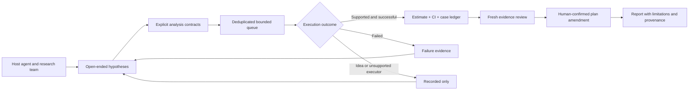

# Agent-led research, evidence-led execution

RDE is a local-first **MCP + harness plugin**. The host agent generates questions,
searches the literature through configured tools, chooses designs with the team,
and writes the interpretation. RDE supplies reusable analyses, case accounting,
durable artifacts, and an auditable route to a reviewed report. It does not require
an embedded model provider or turn the method catalog into a boundary on thinking.

## What changed

`start_autoresearch_run` accepts `agent_proposals` and
`include_builtin_suggestions` (default true). Proposals have a hypothesis, reason,
variables, and optional `analysis_contract`. Agent proposals receive budget slots
before built-ins; identical contracts are deduplicated by canonical SHA-256. All
candidates—including those outside the budget—remain in the baseline artifact.

```json
{
  "project_id": "<project>",
  "max_tasks": 3,
  "max_branches": 3,
  "max_failures": 1,
  "max_minutes": 30,
  "include_builtin_suggestions": false,
  "agent_proposals": [{
    "hypothesis": "Estimate treatment-associated event risk and its uncertainty.",
    "reason": "Absolute risk differences are clinically interpretable even without significance.",
    "variables": ["event", "treatment"],
    "analysis_contract": {
      "tool": "run_advanced_analysis",
      "analysis_type": "risk_estimates",
      "target_variable": "event",
      "group_variable": "treatment",
      "confidence_level": 0.95
    }
  }]
}
```

The runner forwards subject, time, score, covariates, confidence level and supported
clinical options. It no longer silently forces ordinary regression into a
regularized fast backend without inferential uncertainty. Explicit `backend` is
still available for a justified screening analysis.



## Credibility, not significance hunting

- A completed queue is not the same as completed analyses. `recorded_tasks`,
  `completed_tasks`, and `failed_tasks` are separate; idea-only work is never an
  estimated result. Failure artifacts remain available for review.
- Schema, locked plan, and variable-role hashes freeze the design context for a
  run. If they change, the runner requests a new run after review. These are
  **design hashes**, not hashes of raw observations; dataset lineage still needs
  the intake and source artifacts.
- A low p-value does not increase the default evidence-completeness score.
  Scores are advisory organization aids, not acceptance thresholds or clinical
  quality grades. Null estimates with adequate evidence can be reviewed for a
  plan amendment. No branch is automatically merged into primary conclusions.
- Per-analysis analyzed counts replace whole-dataset sample-size assumptions.
  All model p-values are retained rather than selecting the smallest as a
  supposedly representative result. No multiplicity adjustment is implied.
- Source artifacts, a fresh evaluation, and explicit investigator confirmation
  remain mandatory for promotion. This protects claims without restricting ideas.

## Reference systems and deliberate adaptations

Reviewed upstream documentation on 2026-09-16. These are design references, not
runtime dependencies or copied implementation code.

| Reference | Pattern considered | RDE adaptation and boundary |
| --- | --- | --- |
| [Karpathy autoresearch](https://github.com/karpathy/autoresearch) | Fixed time budget, stable evaluation setup, experiment history | Bounded durable queue and frozen design hashes. Clinical quality is not a single optimization metric; no p-value minimization or permission disabling. |
| [Sakana AI Scientist v2](https://github.com/SakanaAI/AI-Scientist-v2) | Open-ended hypothesis generation and exploratory search trees | Host-authored proposals and retained branch lineage. RDE does not execute arbitrary generated code or import its GPU-oriented autonomous runtime. |
| [LangChain Open Deep Research](https://github.com/langchain-ai/open_deep_research) | Configurable research, summarization, reporting, and MCP integration | Separate host reasoning from evidence-producing tools; retain links/artifacts across stages. The upstream repo was archived on 2026-08-21 and is a design reference, not a required service. |

## Limits that remain explicit

The queue is an application-level mechanism, not the MCP Tasks extension. A single
RDE server serializes stateful calls, but its JSONL leases are not a distributed
database lock. Use one writer per project. A time budget prevents starting another
task after expiry; it is not a hard preemption timer for an already running fit.
External methods need a supported executor or separately reviewed evidence; a
recorded proposal alone cannot satisfy analysis completion. Data access, consent,
confounding, missingness sensitivity, external validation, and appropriate
reporting guidelines remain study-specific responsibilities.
