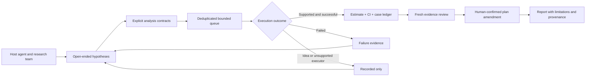

# Agent-led research, evidence-led execution

RDE is a local-first **MCP + harness plugin**. The host agent generates questions,
searches the literature through configured tools, chooses designs with the team,
and writes the interpretation. RDE supplies reusable analyses, case accounting,
durable artifacts, and an auditable route to a reviewed report. It does not require
an embedded model provider or turn the method catalog into a boundary on thinking.

## What changed

`start_autoresearch_run` accepts `agent_proposals` and
`include_builtin_suggestions` (default true). Proposals have a hypothesis, reason,
variables, and optional `analysis_contract`. Agent proposals receive budget slots
before built-ins; identical contracts are deduplicated by canonical SHA-256. All
candidates—including those outside the budget—remain in the baseline artifact.

```json
{
  "project_id": "<project>",
  "max_tasks": 3,
  "max_branches": 3,
  "max_failures": 1,
  "max_minutes": 30,
  "include_builtin_suggestions": false,
  "agent_proposals": [{
    "hypothesis": "Estimate treatment-associated event risk and its uncertainty.",
    "reason": "Absolute risk differences are clinically interpretable even without significance.",
    "variables": ["event", "treatment"],
    "analysis_contract": {
      "tool": "run_advanced_analysis",
      "analysis_type": "risk_estimates",
      "target_variable": "event",
      "group_variable": "treatment",
      "confidence_level": 0.95
    }
  }]
}
```

The runner forwards subject, time, score, covariates, confidence level and supported
clinical options. It no longer silently forces ordinary regression into a
regularized fast backend without inferential uncertainty. Explicit `backend` is
still available for a justified screening analysis.

## Complete local numerical records (development, 2026-10-03)

Local logistic and linear models now save `advanced-model-evidence-v1`: every
model row at its zero-based input position, the actual design matrix, outcome
coding, dummy/reference coding (including dropped constants), fitted values and
response residuals. Parameter order, covariance, coefficient intervals, case
counts, rank, residual degrees of freedom and available optimizer diagnostics
are retained with a canonical JSON SHA256. Fast ridge records retain their
actual centering/scaling and algorithm; they do not claim conventional inference
or convergence that was not tested. A regularized fit is identified explicitly.

Propensity results save **all** scores, stabilized IPTW weights, matching weights
and matched pairs; the former 500-row/500-pair truncation is removed. Matching
remains greedy nearest neighbor without replacement or a caliper. Common
support is described but not used to discard rows. Balance records retain means,
variances and the pooled standard deviation: each stage uses its own denominator;
unweighted variance uses ddof=1 and weighted variance divides by sum of weights.
These are treatment-assignment diagnostics, not an estimated outcome effect.
Binary risk records retain all included outcome/exposure rows, table orientation
and zero-cell limitations without an invisible continuity correction.

Logistic exponentiation no longer caps log intervals at +/-30. Finite large
bounds remain large; floating-point overflow/underflow are identified explicitly.
Nonfinite numerical evidence uses JSON null plus its original location and kind,
not a substituted zero or a finite-looking bound. Invalid nonnumeric linear
outcomes are rejected by the fast backend instead of being filled with zero.
Colliding encoded column names are rejected before fitting.

Native branch JSON uses `advanced-branch-evidence-v1` and its execution wrapper
records the exact file SHA256. It records source bytes observed during execution,
worksheet, input and sanitized-frame fingerprints, and existing derived-variable
and plausibility decisions. A source-file change during execution fails the
attempt. This observation is **not** proof that an in-memory frame was reconstructed
from those exact bytes: source-binding and publication verification remain separate
work. In-memory-only sources are explicitly recorded without a source file.
External vendor results do not acquire local numerical evidence by implication.

Readable reports summarize saved row counts and retain model results; full
individual rows remain in the numerical artifact. Existing results are immutable
and are not backfilled from old plots. General exploration journal editions,
complete source verification and figure bundles rendered solely from these
records are still pending. The existing survival branch publication contract is
unchanged; these numerical additions alone do not make a generic branch a
publication-ready study.


```mermaid
flowchart LR
  A[Host agent and research team] --> B[Open-ended hypotheses]
  B --> C[Explicit analysis contracts]
  C --> D[Deduplicated bounded queue]
  D --> E{Execution outcome}
  E -->|Supported and successful| F[Estimate + CI + case ledger]
  E -->|Failed| G[Failure evidence]
  E -->|Idea or unsupported executor| H[Recorded only]
  F --> I[Fresh evidence review]
  G --> B
  H --> B
  I --> J[Human-confirmed plan amendment]
  J --> K[Report with limitations and provenance]
```

## Credibility, not significance hunting

- A completed queue is not the same as completed analyses. `recorded_tasks`,
  `completed_tasks`, and `failed_tasks` are separate; idea-only work is never an
  estimated result. Failure artifacts remain available for review.
- Schema, locked plan, and variable-role hashes freeze the design context for a
  run. If they change, the runner requests a new run after review. These are
  **design hashes**, not hashes of raw observations; dataset lineage still needs
  the intake and source artifacts.
- A low p-value does not increase the default evidence-completeness score.
  Scores are advisory organization aids, not acceptance thresholds or clinical
  quality grades. Null estimates with adequate evidence can be reviewed for a
  plan amendment. No branch is automatically merged into primary conclusions.
- Per-analysis analyzed counts replace whole-dataset sample-size assumptions.
  All model p-values are retained rather than selecting the smallest as a
  supposedly representative result. No multiplicity adjustment is implied.
- Source artifacts, a fresh evaluation, and explicit investigator confirmation
  remain mandatory for promotion. This protects claims without restricting ideas.

## Reference systems and deliberate adaptations

Reviewed upstream documentation on 2026-09-16. These are design references, not
runtime dependencies or copied implementation code.

| Reference | Pattern considered | RDE adaptation and boundary |
| --- | --- | --- |
| [Karpathy autoresearch](https://github.com/karpathy/autoresearch) | Fixed time budget, stable evaluation setup, experiment history | Bounded durable queue and frozen design hashes. Clinical quality is not a single optimization metric; no p-value minimization or permission disabling. |
| [Sakana AI Scientist v2](https://github.com/SakanaAI/AI-Scientist-v2) | Open-ended hypothesis generation and exploratory search trees | Host-authored proposals and retained branch lineage. RDE does not execute arbitrary generated code or import its GPU-oriented autonomous runtime. |
| [LangChain Open Deep Research](https://github.com/langchain-ai/open_deep_research) | Configurable research, summarization, reporting, and MCP integration | Separate host reasoning from evidence-producing tools; retain links/artifacts across stages. The upstream repo was archived on 2026-08-21 and is a design reference, not a required service. |

## Limits that remain explicit

The queue is an application-level mechanism, not the MCP Tasks extension. A single
RDE server serializes stateful calls, but its JSONL leases are not a distributed
database lock. Use one writer per project. A time budget prevents starting another
task after expiry; it is not a hard preemption timer for an already running fit.
External methods need a supported executor or separately reviewed evidence; a
recorded proposal alone cannot satisfy analysis completion. Data access, consent,
confounding, missingness sensitivity, external validation, and appropriate
reporting guidelines remain study-specific responsibilities.
